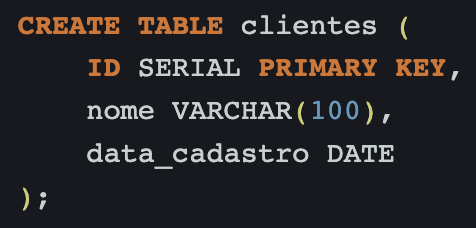

# Banco de Dados II - Desafio 2 Code Park 2

## Instruções do projeto

Uma loja tem um banco de dados que contém todo o controle de vendas de produtos e de cadastro de clientes. Pensando nisso, crie uma função para somar todos os clientes que foram cadastrados na loja durante um dia.

Trabalhe esse código em seu IDE, suba ele para sua conta no GitHub e compartilhe o link desse projeto no campo ao lado para que outros desenvolvedores possam analisá-lo.

## Resolução

